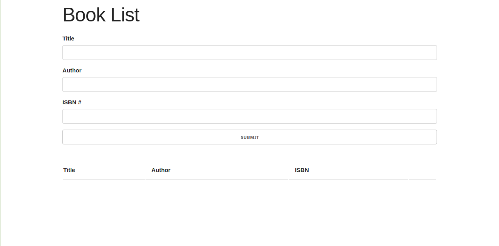
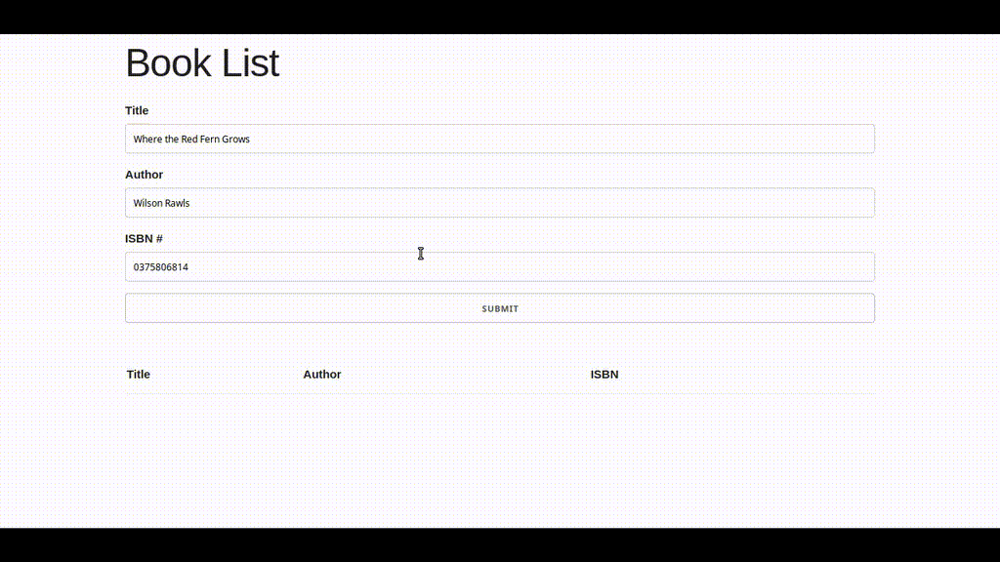
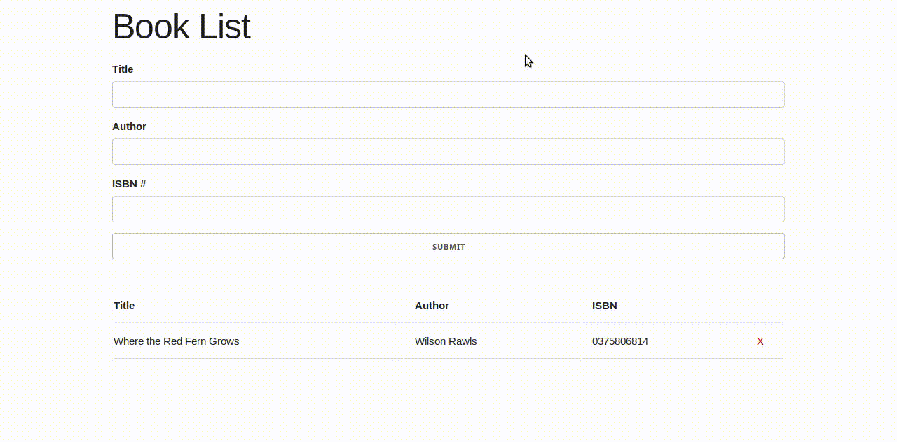
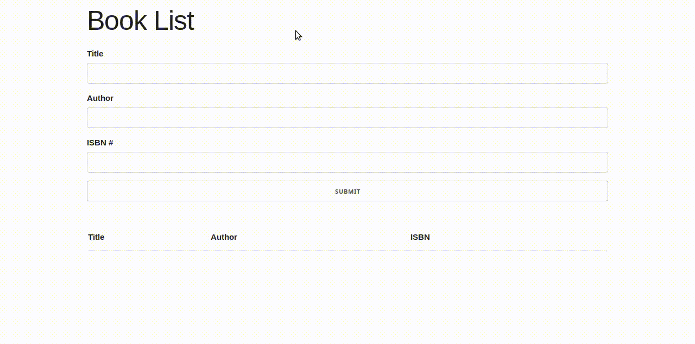

<h1 align="center">JS Book List</h1>

A book list web app built with JavaScript

## Table of Contents
* [Project Status](#project-status)
* [Features](#features)
* [Screenshots](#screenshots)
* [Technologies](#technologies)
* [Inspirations](#inspirations)
* [Contact](#contact)
* [License](#license)

## Project Status
This project is currently: _Complete_

## Features
Complete:
- [X] User can add books to the list
- [X] User can remove books from the list
- [X] Display alerts when books are added or removed
- [X] Book list persists in user's localStorage

## Screenshots

## Technologies
Built with:
* JavaScript
* HTML
* CSS / Skeleton

## Inspirations
This project was built as part of Brad Traversy's Udemy course [Modern JavaScript from the Beginning](https://www.udemy.com/modern-javascript-from-the-beginning/).

## Contact
Twitter - [@CBStanley12](https://twitter.com/CBStanley12)

DEV - [cbstanley12](https://dev.to/cbstanley12)

Personal Website - [cbstanley.tech](https://cbstanley.tech)

## License
**MIT License**: 
A short and simple permissive license with conditions only requiring preservation of copyright and license notices. Licensed works, modifications, and larger works may be distributed under different terms and without source code.